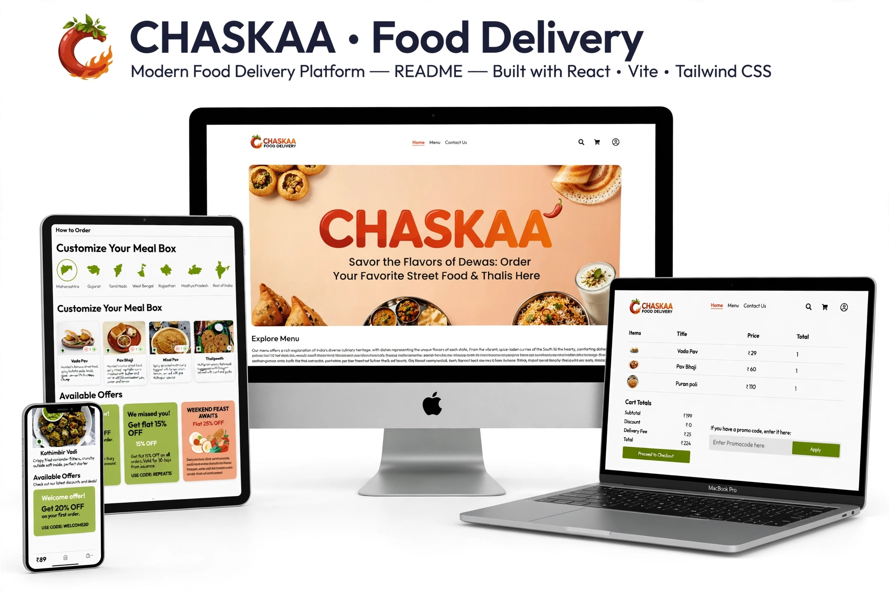

  <p align="center">
  
</p>


# About The Project

**Chaskaa** is a MERN stack food ordering platform that connects customers with the comfort of home-cooked meals. Easily explore a wide selection of homemade food options and get them delivered to your door. **Chaskaa** emphasizes traditional, authentic meals, offering simplicity and convenience.


## Built With

<p>
  
</p>

## Getting Started

Follow these instructions to set up the project locally on your machine.

### Prerequisites

Make sure you have the following installed on your system:
- **Node.js** (v14 or later)
- **npm** or **yarn** (for package management)

### Installation

1. **Clone the repository**:

   ```bash
    git clone https://github.com/kajalyadav30/Chaskaa.git
    cd Chaskaa
    ```
2. **Install dependencies for the frontend, backend, and admin dashboard**:
   - For Frontend:
     ```bash
       cd Frontend
       npm install
     ```
   - For Backend:
     ```bash
       cd ../Backend
       npm install
     ```
   - For Admin Dashboard:
     ```bash
       cd ../Admin
       npm install
     ```

### Running the Application

1. **Start the Backend**:
   ```bash
   cd Backend
   npm run server
   ```
   This will start the backend server on the specified port (default is `http://localhost:4000`).  
   You can change the port from [server.js]

2. **Start the Frontend (Customer Portal)**:
   ```bash
   cd Frontend
   npm run dev
   ```
   This will start the customer-facing frontend on `http://localhost:5173`.

3. **Start the Admin Dashboard**:
   ```bash
   cd Admin
   npm run dev
   ```
   This will start the admin dashboard on `http://localhost:5174`.

### Environment Variables

Each part of the project (Frontend, Backend, Admin) requires its own `.env` file with appropriate environment variables.

1. **Backend**:  
   Create a `.env` file in the **Backend** folder with the following variables:
   ```
   DB_URI=your_mongo_connection_string
   JWT_SECRET=your_jwt_secret
   ```

2. **Frontend**:  
   Create a `.env` file in the **Frontend** folder with the following variables:
   ```
   VITE_BACKEND_URL=http://localhost:4000 or Your Deployed Backend URL
   ```

3. **Admin Dashboard**:  
   Create a `.env` file in the **Admin** folder with the following variables:
   ```
   VITE_BACKEND_URL=http://localhost:4000 or Your Deployed Backend URL
   ```

### Explore the App

- **Frontend (Customer Portal)**: Open `http://localhost:5173` to view the customer-facing interface.
- **Admin Dashboard**: Open `http://localhost:5174` to view the admin interface.

## How It Works

1. **Sign Up**: New users can create an account to get started.
2. **Login**: Existing users can log in to their accounts.
3. **Add to Cart**: After logging in, users can browse and add food items to their cart.
4. **Promocode**: Users can enter a promocode in the designated section to receive discounts. There are two types of coupons: percentage and fixed amount.
5. **Address Form**: Users fill out the address form before placing an order.
6. **Order Placement**: After reviewing their order, users can click on "Order." Upon successful order placement, they can view their order in the orders section.

### Admin Dashboard Features

- Admins can add or delete food items and promocodes.
- Admins can set the status of orders.

### Future Updates

- **Profile Page**: Users can manage personal details and view order history.
- **Saved Addresses**: Allow users to choose previously used addresses for faster checkout.
- **Real-Time Delivery Tracking**: Users can track their orders in real-time.
- **Payment Gateway Integration**: Facilitate secure payments upon acquiring an API key.
- **Search Functionality**: Enable users to find dishes quickly.
- **User Reviews and Ratings**: Customers can provide feedback on meals.
- **Admin Analytics Dashboard**: Insights on sales and customer behavior.

## Repository Structure

The project is divided into three main parts:

1. **Frontend**:  
   The customer-facing food ordering platform is built using **React (Vite)**. This section handles user interactions, displaying food items, and managing the cart and checkout process.

2. **Backend**:  
   The server-side API, built with **Node.js** and **Express**, handles data processing, database operations, and serves requests from both the frontend and admin dashboard.

3. **Admin Dashboard**:  
   A dedicated admin interface built using **React (Vite)**, allowing admins to manage food items, orders, and promocodes. It is connected to the backend for data management and order processing.
